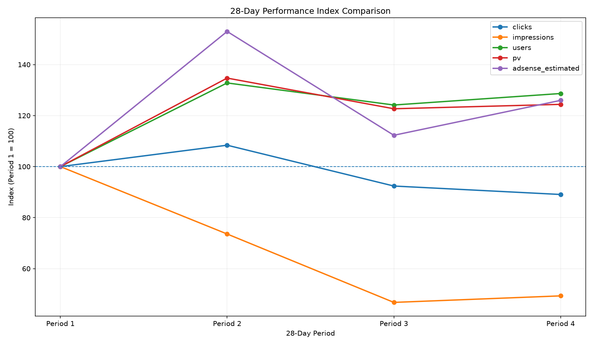
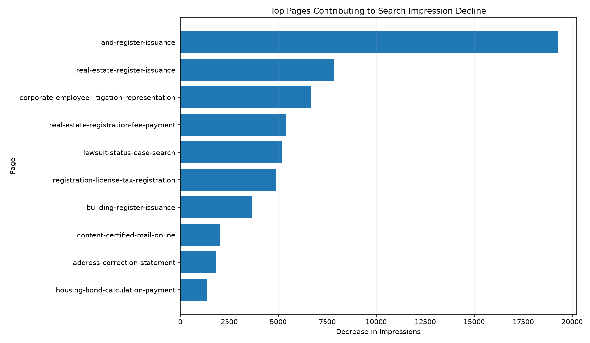
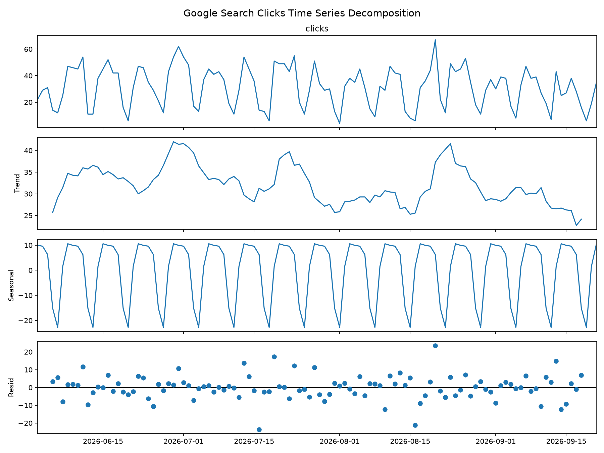
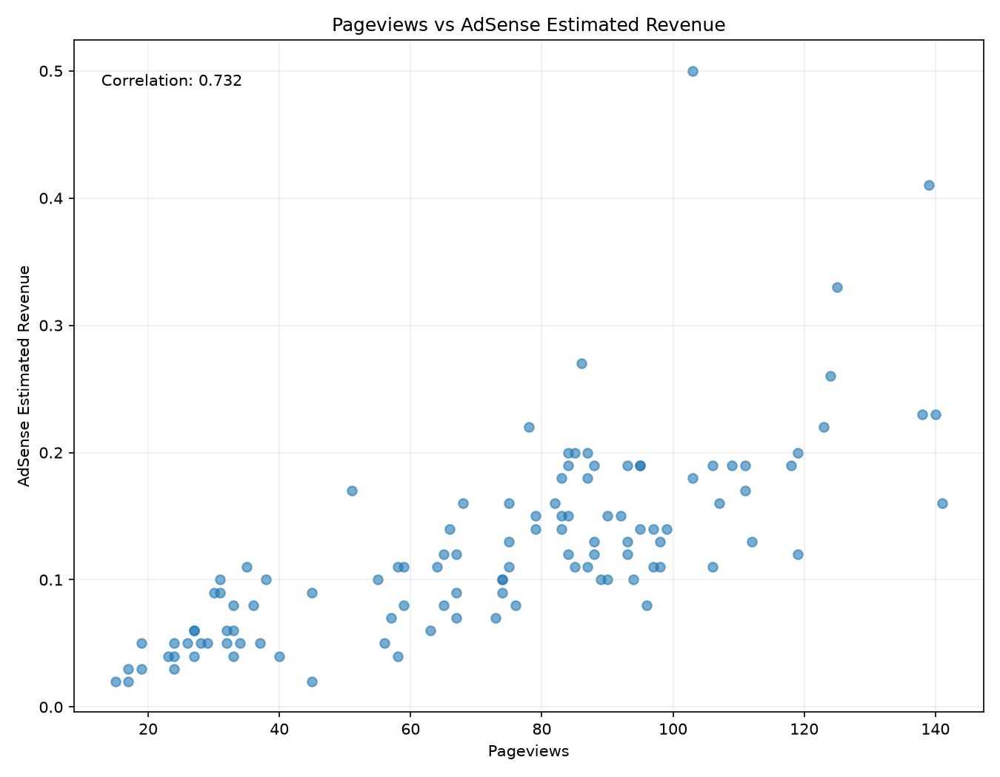
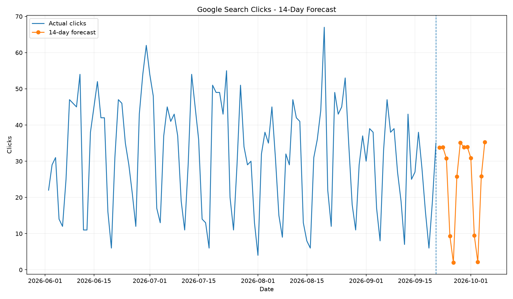
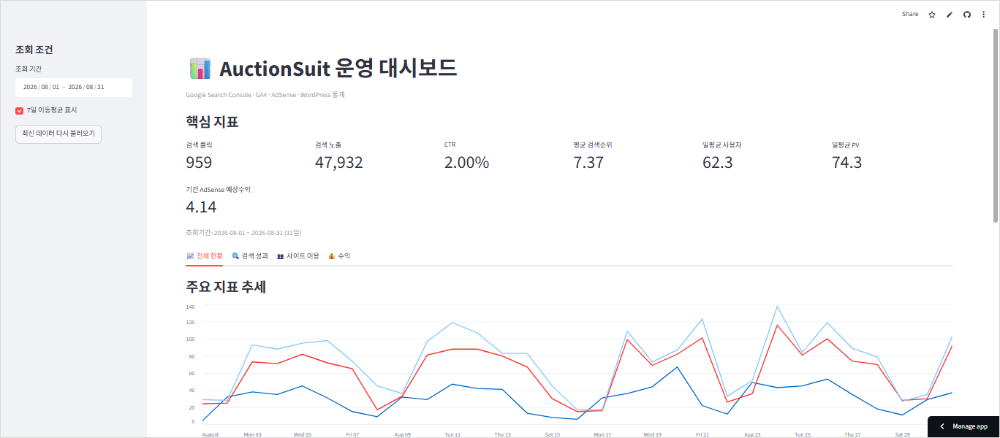
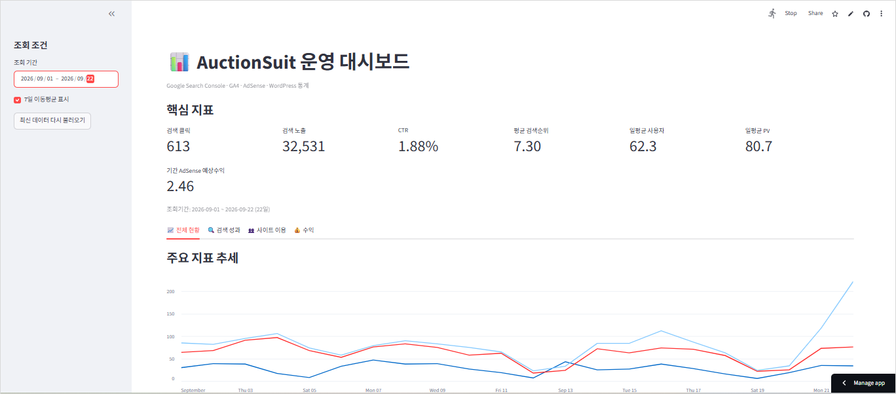

# M1-1 | AI 데이터 분석: 데이터 기반 트렌드 분석

## 프로젝트 개요

옥션슈트(AuctionSuit)는 경매·공매·소송 관련 정보를 제공하는 웹사이트입니다.

본 프로젝트에서는 옥션슈트 운영 과정에서 수집한 Google Search Console, GA4, Google AdSense, WordPress 데이터를 활용하여 검색 유입과 사이트 이용 성과의 변화를 시계열 관점에서 분석했습니다.

분석 과정에서 검색 노출수는 크게 감소했지만 검색 클릭수는 상대적으로 유지되고, CTR과 사용자·페이지뷰·광고수익은 초기보다 높은 수준을 보이는 현상을 확인했습니다.

이에 다음 질문을 중심으로 분석을 수행했습니다.

1. 옥션슈트의 검색·방문·수익 지표는 분석기간 동안 어떻게 변화했는가?
2. 검색 노출 감소는 어떤 페이지와 검색어에서 주로 발생했는가?
3. 검색 노출 감소에도 클릭과 CTR이 상대적으로 유지·개선된 현상은 어떻게 설명할 수 있는가?
4. 사이트 이용량과 AdSense 예상수익은 어떤 관계를 보이는가?

---

## 분석 주제

**옥션슈트 검색 노출 감소는 성과 악화인가?  
검색 유입 구조와 사이트 이용 성과의 시계열 분석**

---

## 분석 데이터

### 데이터 출처

Google Sheets에 자동 수집 중인 옥션슈트 운영 데이터를 사용했습니다.

| 데이터 | 주요 항목 |
|---|---|
| Google Search Console | 클릭, 노출, CTR, 평균 검색순위, 페이지, 검색어 |
| Google Analytics 4 | 사용자, 페이지뷰 |
| Google AdSense | 예상수익 |
| WordPress | 게시물 수 |

### 분석기간

- 2026-06-02 ~ 2026-09-21
- 총 112일
- 일별 시계열 데이터

분석기간은 재현성을 위해 `src/config.py`에서 고정했습니다.

```python
ANALYSIS_START_DATE = "2026-06-02"
ANALYSIS_END_DATE = "2026-09-21"
```

운영용 Streamlit 대시보드는 고정 분석기간과 별도로 Google Sheets의 최신 데이터를 조회합니다.

---

## 주요 분석 방법

- 데이터 타입 변환 및 날짜 정렬
- 결측값·중복 날짜·누락 날짜 확인
- 7일 이동평균
- 28일 구간별 성과 비교
- 요일별 평균 분석
- 페이지별·검색어별 검색성과 증감 분석
- Pearson 상관분석
- 시계열 분해
- Holt-Winters Exponential Smoothing 예측

---

## 주요 분석 결과

### 1. 검색 노출은 크게 감소했지만 사이트 전체 성과는 같은 방향으로 움직이지 않음

28일 구간별 비교에서 검색 노출은 초기 평균 약 3,154회에서 최근 약 1,556회로 크게 감소했습니다.

반면 사용자, 페이지뷰, AdSense 예상수익은 초기 구간보다 최근 구간에서 높은 수준을 기록했습니다.



### 2. 검색 노출 감소는 일부 기존 대형 페이지에 집중

특히 다음과 같은 페이지에서 검색 노출 감소폭이 크게 나타났습니다.

- `land-register-issuance`
- `real-estate-register-issuance`
- `corporate-employee-litigation-representation`
- `real-estate-registration-fee-payment`



전체 검색 노출 감소를 사이트 전체의 균등한 하락으로 해석하기보다는 페이지별 구조 변화를 함께 확인할 필요가 있었습니다.

### 3. 검색 클릭에는 강한 7일 계절성이 존재

검색 클릭 시계열을 분해한 결과 반복적인 7일 주기가 뚜렷하게 나타났습니다.



특정 하루의 성과보다 이동평균이나 동일 요일 간 비교가 운영 성과 판단에 더 적합할 수 있음을 확인했습니다.

### 4. 페이지뷰와 AdSense 예상수익은 양의 상관관계를 보임

페이지뷰와 AdSense 예상수익의 Pearson 상관계수는 약 **0.732**로 나타났습니다.



다만 상관관계는 인과관계를 의미하지 않으므로 직접적인 원인으로 해석하지 않았습니다.

---

## 시계열 예측

Holt-Winters Exponential Smoothing을 사용하여 검색 클릭수의 7일 계절성을 반영한 14일 예측을 수행했습니다.

마지막 14일을 테스트 데이터로 사용한 백테스트 결과:

**MAE = 9.377**



본 예측은 정밀한 미래 클릭수 예측보다는 기존 주간 패턴이 계속된다는 가정에 따른 베이스라인 모델로 해석했습니다.

---

## Streamlit 대시보드

분석 결과를 실제 사이트 운영에도 활용할 수 있도록 Streamlit 기반 대시보드를 구현했습니다.

### 주요 기능

- Google Sheets 최신 데이터 조회
- 조회기간 변경
- Google 검색 클릭·노출·CTR·평균순위 확인
- 사용자·페이지뷰 확인
- AdSense 예상수익 확인
- 7일 이동평균 표시
- 검색 성과 / 사이트 이용 / 수익 탭
- 최신 데이터 다시 불러오기

### 배포 주소

https://auctionsuit-dashboard.streamlit.app/

### 대시보드 화면





---

## 프로젝트 구조

```text
M1-1/
├─ images/
│  ├─ 01_search_clicks_trend.png
│  ├─ 02_search_impressions_trend.png
│  ├─ 03_website_traffic_trend.png
│  ├─ 04_adsense_revenue_trend.png
│  ├─ 05_search_ctr_trend.png
│  ├─ 06_search_position_trend.png
│  ├─ 07_weekday_clicks.png
│  ├─ 08_weekday_impressions.png
│  ├─ 09_28day_index_comparison.png
│  ├─ 10_top_page_impression_decreases.png
│  ├─ 11_pv_adsense_relationship.png
│  ├─ 12_clicks_decomposition.png
│  ├─ 13_clicks_forecast.png
│  ├─ 14_dashboard_overview.png
│  └─ 15_dashboard_interactive.png
├─ src/
│  ├─ analysis.py
│  ├─ config.py
│  ├─ data_loader.py
│  └─ preprocess.py
├─ app.py
├─ REPORT.md
├─ README.md
├─ requirements.txt
└─ .gitignore
```

`credentials/service_account.json`은 보안상 GitHub 저장소에 포함하지 않습니다.

---

## 실행 방법

### 1. 저장소 복제

```bash
git clone https://github.com/neoinkyu/M1-1.git
cd M1-1
```

### 2. 패키지 설치

```bash
pip install -r requirements.txt
```

### 3. Google Sheets 인증

로컬 환경에서는 다음 위치에 Google Cloud 서비스 계정 인증파일이 필요합니다.

```text
credentials/service_account.json
```

해당 인증파일은 `.gitignore`를 통해 GitHub에서 제외했습니다.

Streamlit Community Cloud에서는 Secrets 기능을 통해 인증정보를 관리합니다.

### 4. 분석 실행

```bash
python src/analysis.py
```

분석 결과는 터미널에 출력되며 시각화 결과는 `images/` 폴더에 저장됩니다.

### 5. Streamlit 실행

```bash
streamlit run app.py
```

---

## 사용 기술

| 구분 | 기술 |
|---|---|
| 언어 | Python |
| 데이터 처리 | pandas, numpy |
| 시각화 | matplotlib |
| 시계열 분석 | statsmodels |
| 웹 대시보드 | Streamlit |
| 데이터 연결 | gspread, Google Sheets API |
| 버전 관리 | Git, GitHub |
| 개발환경 | VS Code |

---

## 분석 한계

현재 데이터만으로는 검색 클릭 감소와 사이트 사용자·페이지뷰 증가가 동시에 발생한 원인을 유입 채널별로 설명할 수 없습니다.

향후 GA4의 Organic Search, Direct, Referral, Social 등 유입 채널 데이터를 추가하면 검색 외 유입의 영향을 분석할 수 있습니다.

또한 Google Search Console의 일별 데이터는 Pacific Time 기준이므로 현재 요일 분석은 한국 현지 요일과 직접 일치하지 않습니다. 향후 시간별 데이터를 수집해 한국시간으로 변환할 필요가 있습니다.

검색어 역시 검색 의도별로 체계적으로 분류하지 않았으므로 검색 유입의 질적 변화에 관한 해석은 가설 수준으로 제한했습니다.

---

## AI 활용

생성형 AI는 다음 과정에서 활용했습니다.

- 분석 질문 구조화
- Python 코드 작성 보조
- 오류 원인 분석 및 수정
- 분석 결과 해석 보조
- Streamlit 대시보드 구현
- 보고서 구성 및 문장 정리

AI의 제안을 그대로 사용하지 않고 Python 실행 결과, Google Sheets 원본 데이터, 시각화 결과를 직접 확인해 검증했습니다.

관찰된 사실과 가능한 해석을 구분했으며 상관관계를 인과관계로 해석하지 않았습니다.

---

## 상세 분석 보고서

분석 과정, 결과, 해석, 한계 및 AI 활용 기록은 아래 문서에 정리했습니다.

**[REPORT.md](REPORT.md)**

---

## GitHub Repository

https://github.com/neoinkyu/M1-1
