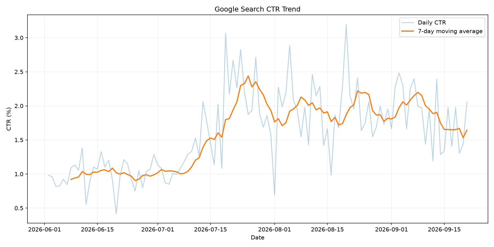
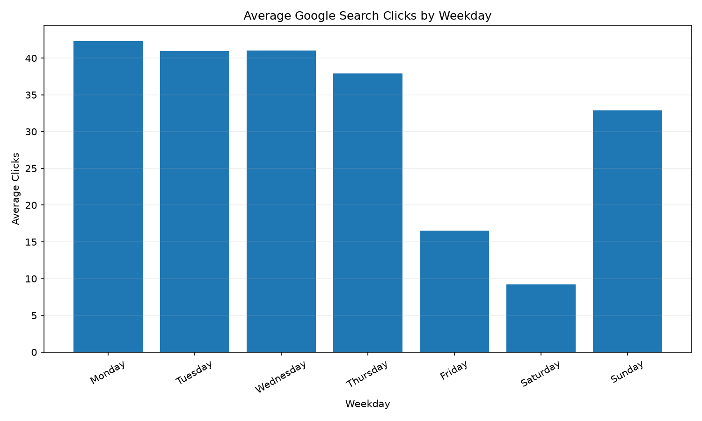

# 옥션슈트 검색 노출 감소는 성과 악화인가?
## 검색 유입 구조와 사이트 이용 성과의 시계열 분석

## 1. 분석 개요

옥션슈트(https://www.auctionsuit.com/)는 경매·공매·소송 관련 정보를 제공하는 개인 운영 웹사이트이다.

본 프로젝트에서는 옥션슈트 운영 과정에서 수집한 Google Search Console, Google Analytics 4(GA4), Google AdSense, WordPress 데이터를 활용해 검색 유입과 사이트 이용 성과의 변화를 시계열 관점에서 분석하였다.

운영 과정에서 검색 노출수는 크게 감소하는 반면 검색 클릭수는 상대적으로 유지되고, 사이트 사용자·페이지뷰·광고수익은 초기보다 높은 수준을 보이는 현상이 확인되었다.

따라서 단순히 검색 노출 감소를 사이트 성과 악화로 판단할 수 있는지, 아니면 검색 유입 구조와 사이트 이용 패턴이 변화하고 있는지를 시계열 데이터를 통해 분석하였다.

---

## 2. 분석 질문

본 분석에서는 다음 질문을 중심으로 데이터를 살펴보았다.

1. 옥션슈트의 검색·방문·수익 지표는 분석기간 동안 어떤 추세를 보였는가?
2. 검색 노출 감소는 어떤 페이지와 검색어에서 주로 발생했는가?
3. 검색 노출 감소에도 검색 클릭과 CTR이 상대적으로 유지·개선된 현상은 어떻게 설명할 수 있는가?
4. 사이트 이용량과 AdSense 예상수익은 어떤 관계를 보이는가?

추가로 시계열 특성을 확인하기 위해 요일별 패턴과 7일 주기의 계절성을 분석하고, 간단한 미래 클릭수 예측을 수행하였다.

---

## 3. 데이터 설명

### 3.1 데이터 출처

분석에 사용한 데이터는 옥션슈트 운영 과정에서 Google Sheets에 자동으로 수집하고 있는 데이터를 이용하였다.

주요 데이터 출처는 다음과 같다.

- **Google Search Console**
  - 검색 클릭수
  - 검색 노출수
  - CTR
  - 평균 검색순위
  - 페이지별 검색 성과
  - 검색어별 검색 성과
- **Google Analytics 4**
  - 사용자 수
  - 페이지뷰
- **Google AdSense**
  - 일별 예상수익
- **WordPress**
  - 게시물 수

Google Sheets를 원본 데이터 저장소로 사용하였으며, Python에서 Google Sheets API를 통해 직접 데이터를 조회하였다.

별도의 CSV 복사본은 생성하지 않았으며, 분석 재현성을 위해 코드에서 분석기간을 고정하였다.

### 3.2 분석기간

- 시작일: **2026-06-02**
- 종료일: **2026-09-21**
- 데이터 포인트: **112개**
- 데이터 주기: **일별**

112일은 28일 × 4개 구간으로 정확히 나누어지므로 구간별 성과 비교에도 활용하였다.

실제 운영용 Streamlit 대시보드는 고정된 분석기간이 아니라 Google Sheets의 최신 데이터를 조회하도록 별도로 구성하였다.

---

## 4. 데이터 전처리 및 품질 확인

### 4.1 날짜와 숫자형 변환

Google Sheets에서 읽어온 데이터에 대해 다음 전처리를 수행하였다.

- 날짜 컬럼을 `datetime` 형식으로 변환
- 클릭수, 노출수, 사용자수, 페이지뷰, 수익 등 주요 지표를 숫자형으로 변환
- 날짜 기준 오름차순 정렬
- `daily_stats`와 `gsc_daily`를 날짜 기준으로 병합

### 4.2 결측치 및 중복 확인

분석 전 다음 항목을 점검하였다.

- 중복 날짜
- 누락된 날짜
- 주요 컬럼의 결측값

고정 분석기간의 병합 데이터에서는 일별 데이터가 연속적으로 존재하여 별도의 결측값 보간을 수행하지 않았다.

### 4.3 이상값 처리

특정 일자의 클릭수, 페이지뷰, AdSense 수익이 주변 일자보다 크게 나타나는 사례가 있었으나 원본 데이터 오류로 판단할 근거가 없으므로 삭제하지 않았다.

대신 이동평균과 기간별 평균을 함께 사용하여 일별 변동에 과도하게 영향을 받지 않도록 분석하였다.

---

## 5. 분석 방법

### 5.1 7일 이동평균

일별 변동성을 완화하고 중기 추세를 확인하기 위해 주요 지표에 7일 이동평균을 적용하였다.

대상 지표:

- 검색 클릭
- 검색 노출
- 사용자
- 페이지뷰
- AdSense 예상수익

### 5.2 28일 구간별 비교

112일을 각각 28일인 4개 구간으로 나누어 평균 성과를 비교하였다.

### 5.3 요일별 평균

요일별 클릭수, 노출수, 사용자, 페이지뷰, 수익을 비교하여 반복적인 주간 패턴이 존재하는지 확인하였다.

### 5.4 페이지·검색어 증감 분석

초기 28일과 최근 28일의 페이지별·검색어별 검색 노출 및 클릭 변화를 비교하였다.

### 5.5 상관분석

다음 주요 변수 사이의 Pearson 상관계수를 계산하였다.

- 검색 클릭 ↔ 사용자
- 검색 클릭 ↔ 페이지뷰
- 사용자 ↔ 페이지뷰
- 페이지뷰 ↔ AdSense 예상수익
- 사용자 ↔ AdSense 예상수익

### 5.6 시계열 분해

검색 클릭수에 대해 `period=7`의 가법적 시계열 분해를 적용하여 다음 요소를 확인하였다.

- Trend
- Seasonal
- Residual

### 5.7 간단한 미래 예측

Holt-Winters Exponential Smoothing을 이용해 검색 클릭수의 7일 계절성을 반영하였다.

마지막 14일을 테스트 데이터로 분리하여 백테스트한 뒤 전체 데이터로 다시 학습하여 향후 14일을 예측하였다.

---

## 6. 분석 결과

### 6.1 검색 노출 감소와 사이트 이용량의 변화

28일 구간별 평균은 다음과 같다.

| 구간 | 기간 | 클릭 | 노출 | CTR | 평균순위 | 사용자 | PV | 수익 |
|---|---|---:|---:|---:|---:|---:|---:|---:|
| 1 | 06-02 ~ 06-29 | 32.357 | 3,154.107 | 0.010 | 7.509 | 49.107 | 60.000 | 0.102 |
| 2 | 06-30 ~ 07-27 | 35.071 | 2,320.893 | 0.016 | 7.145 | 65.214 | 80.821 | 0.156 |
| 3 | 07-28 ~ 08-24 | 29.893 | 1,475.000 | 0.019 | 7.356 | 60.964 | 73.607 | 0.114 |
| 4 | 08-25 ~ 09-21 | 28.821 | 1,555.679 | 0.018 | 7.419 | 63.179 | 74.643 | 0.128 |


#### 관찰 사실

1구간과 4구간을 비교하면 검색 노출은 약 절반 수준까지 감소하였다.

반면 검색 클릭은 노출수만큼 크게 감소하지 않았다.

사용자, 페이지뷰, AdSense 예상수익은 모두 1구간보다 4구간에서 높은 수준을 보였다.

따라서 **검색 노출 감소와 사이트 전체 이용 성과가 같은 방향으로 움직이지 않았다.**

또한 성과가 기간 전체에서 지속적으로 상승한 것은 아니다. 사용자·PV·수익은 2구간에서 가장 높은 수준을 보인 후 3구간에서 하락하고 4구간에서 일부 회복하였다.

따라서 본 분석에서는 이를 “지속적 성장”이라고 해석하지 않았다.

---

### 6.2 CTR 상승과 평균순위 변화

초기 7일과 최근 7일을 비교하면 다음과 같다.

- 클릭: 25.714 → 24.143, **-6.1%**
- 노출: 2,760 → 1,460.714, **-47.1%**
- CTR: 0.009 → 0.016, **+78.4%**
- 평균순위: 7.691 → 7.509
- 사용자: 41.429 → 55.000, **+32.8%**
- PV: 50.429 → 74.571, **+47.9%**
- AdSense 예상수익: 0.087 → 0.109, **+24.6%**



#### 관찰 사실

노출수 감소폭에 비해 클릭수 감소폭은 훨씬 작았으며 CTR은 크게 상승하였다.

평균 검색순위는 큰 폭으로 개선되지 않았다.

#### 해석

따라서 CTR 상승을 평균 검색순위 개선만으로 설명하기는 어렵다.

페이지와 검색어의 구성 변화가 CTR 변화와 함께 나타났을 가능성이 있으므로 페이지·검색어 단위 분석을 추가하였다.

---

### 6.3 검색 노출 감소는 일부 페이지에 집중

초기 28일과 최근 28일을 비교한 결과, 가장 큰 노출 감소는 다음 페이지에서 발생하였다.

대표 사례:

- `land-register-issuance`
  - 27,048 → 7,798
  - **-19,250**
- `real-estate-register-issuance`
  - 11,221 → 3,391
  - **-7,830**
- `corporate-employee-litigation-representation`
  - 7,772 → 1,078
  - **-6,694**
- `real-estate-registration-fee-payment`
  - 11,707 → 6,297
  - **-5,410**


특히 `real-estate-registration-fee-payment` 페이지는 노출이 5,410회 감소했지만 클릭수는 69회에서 70회로 거의 변하지 않았다.

또한 `address-correction-statement`는 노출이 감소했음에도 클릭은 56회에서 76회로 증가하였다.

#### 관찰 사실

검색 노출 감소는 사이트 전체에 균등하게 발생한 것이 아니라 일부 기존 대형 페이지에 상당 부분 집중되어 있었다.

#### 해석·가설

일부 페이지에서는 노출량이 크게 감소했음에도 클릭이 유지되거나 증가하였다.

이는 단순한 노출 규모보다 실제 클릭으로 연결되는 검색 노출의 비중이 상대적으로 높아졌을 가능성을 보여준다.

다만 본 분석만으로 **“검색 유입의 질이 향상되었다”라고 단정할 수는 없다.**

이를 확인하려면 검색 의도 분류, 유입 후 행동, 전환 등의 추가 데이터가 필요하다.

---

### 6.4 검색어 구성의 변화

노출 감소 검색어 가운데 다음과 같은 광범위한 행정·서류 관련 검색어의 감소폭이 컸다.

- `토지대장`: -4,850
- `토지대장 열람`: -1,089
- `토지대장 발급`: -554
- `건축물대장 발급`: -525
- `건축물대장 인터넷 발급`: -360

반대로 다음과 같은 검색어는 최근 구간에서 증가하였다.

- `보정명령등본`
- `보정서`
- `재산명시 작성법`
- `등기신청수수료`
- `등기신청사건조회`

#### 해석·가설

대량 노출을 만들던 일부 범용 행정 검색어의 노출이 감소하는 동시에 보다 구체적인 소송·등기 관련 검색어가 일부 증가하는 패턴이 확인되었다.

이는 전체 노출수 감소와 CTR 상승이 동시에 발생한 배경을 설명할 수 있는 하나의 가능성이다.

그러나 검색어를 체계적으로 검색 의도별로 분류하지 않았으므로 본 결과는 **가설 수준의 해석**으로 제한하였다.

---

### 6.5 사이트 이용량과 광고수익의 관계

주요 지표의 상관계수는 다음과 같다.

- 검색 클릭 ↔ 사용자: **0.547**
- 검색 클릭 ↔ PV: **0.483**
- 사용자 ↔ PV: **0.948**
- PV ↔ AdSense 예상수익: **0.732**
- 사용자 ↔ AdSense 예상수익: **0.740**


사용자와 페이지뷰 사이에는 매우 높은 양의 상관관계가 확인되었다.

페이지뷰와 AdSense 예상수익 사이에도 0.732의 양의 상관관계가 나타났다.

#### 해석

사이트 이용량이 많았던 날에 광고수익도 상대적으로 높은 경향이 있었다.

다만 상관관계는 두 변수가 함께 움직였다는 의미이며 **페이지뷰 증가가 광고수익 증가의 직접적인 원인임을 증명하지는 않는다.**

또한 일부 높은 PV·수익값이 상관계수에 영향을 주었을 가능성도 있다.

---

## 7. 주간 계절성 분석

요일별 검색 클릭 평균은 다음과 같았다.

| 요일 | 평균 클릭 | 평균 노출 |
|---|---:|---:|
| 월 | 42.312 | 2,777.312 |
| 화 | 40.938 | 2,684.875 |
| 수 | 41.000 | 2,688.875 |
| 목 | 37.938 | 2,512.750 |
| 금 | 16.500 | 1,219.062 |
| 토 | 9.188 | 824.812 |
| 일 | 32.875 | 2,177.250 |



요일에 따라 클릭과 노출의 차이가 크게 나타났다.

다만 Google Search Console 일별 데이터의 날짜 기준은 Pacific Time이므로 이 결과를 한국 현지 요일과 직접 동일하게 해석할 수 없다.

한국 시간 기준의 정확한 요일·시간 분석을 위해서는 향후 GSC 시간별 데이터를 수집하고 시간대를 변환할 필요가 있다.

---

## 8. 보너스 분석 1: 시계열 분해

검색 클릭수를 7일 주기로 분해하였다.


분해 결과:

- **Trend**: 일정한 장기 상승이 아니라 상승과 하락이 반복됨
- **Seasonal**: 매우 뚜렷한 7일 주기가 반복됨
- **Residual**: 대부분 0 주변에 위치하지만 일부 큰 양·음의 변동 존재

검색 클릭수에는 뚜렷한 **주간 계절성**이 존재하였다.

반면 분석기간 전체를 관통하는 지속적인 상승 추세는 확인되지 않았다.

---

## 9. 보너스 분석 2: 검색 클릭 예측

Holt-Winters Exponential Smoothing을 적용하여 7일 주기의 계절성을 반영한 클릭수 예측을 수행하였다.

마지막 14일인 2026-09-08 ~ 2026-09-21을 테스트 구간으로 사용하였다.

백테스트 결과:

- **MAE: 9.377**


이는 예측값과 실제값 사이에 하루 평균 약 **9.4회의 절대 오차**가 있었다는 의미이다.

모형은 분석기간에서 확인된 7일 주기를 미래에도 반복하는 형태로 예측하였다.

다만 일별 클릭량에 비해 MAE가 작지 않으므로 정밀한 미래 방문량 예측모델로 사용하기에는 한계가 있다.

따라서 이번 예측은 **기존 주간 패턴이 지속된다는 가정 아래의 베이스라인 예측**으로 해석하였다.

---

## 10. 보너스 과제: Streamlit 대시보드

분석 결과를 실제 운영에도 활용할 수 있도록 Streamlit 기반 웹 대시보드를 구현하였다.

주요 기능:

- Google Sheets 최신 데이터 자동 조회
- 조회기간 변경
- 검색 클릭·노출·CTR·평균순위 확인
- 사용자·PV 확인
- AdSense 예상수익 확인
- 7일 이동평균 표시 여부 선택
- 검색 성과 / 사이트 이용 / 수익 탭 제공
- 최신 데이터 새로고침

정적 분석과 운영 대시보드의 목적을 분리하였다.

- REPORT 분석기간: **2026-06-02 ~ 2026-09-21 고정**
- 운영 대시보드: **Google Sheets 최신 데이터 사용**

### 대시보드 전체 화면


### 기간 변경 및 탐색 화면


배포 주소:

https://auctionsuit-dashboard.streamlit.app/

---

## 11. 주요 인사이트

### 인사이트 1. 검색 노출 감소를 사이트 전체 성과 악화로 단순 해석하기 어렵다

검색 노출은 초기 구간 대비 약 절반 수준으로 감소했지만 클릭 감소폭은 훨씬 작았다.

동시에 사용자, 페이지뷰, AdSense 예상수익은 초기보다 높은 수준을 유지하였다.

따라서 검색 노출이라는 단일 지표만으로 옥션슈트의 전체 성과를 판단하는 것은 적절하지 않다.

### 인사이트 2. 전체 노출 감소의 상당 부분은 일부 기존 대형 페이지·검색어에 집중되어 있다

특히 `land-register-issuance`와 `토지대장` 관련 검색 노출 감소폭이 매우 컸다.

반면 일부 페이지에서는 노출이 감소해도 클릭이 유지되거나 증가하였다.

따라서 향후 SEO 성과를 평가할 때 전체 노출수뿐만 아니라 **페이지별·검색어별 구조 변화**를 함께 확인할 필요가 있다.

### 인사이트 3. 검색 클릭에는 강한 주간 계절성이 존재한다

요일별 평균 및 시계열 분해에서 반복적인 7일 주기가 확인되었다.

따라서 특정 하루의 클릭수만으로 성과를 판단하기보다 이동평균이나 동일 요일 간 비교가 더 적절하다.

### 인사이트 4. 사이트 이용량과 광고수익은 함께 움직이는 경향이 있다

PV와 AdSense 예상수익의 상관계수는 0.732, 사용자와 AdSense 예상수익은 0.740이었다.

따라서 단순 검색 노출 확대뿐 아니라 실제 사이트 방문 및 페이지 소비를 늘리는 것이 운영상 중요한 지표라고 볼 수 있다.

다만 이는 상관관계이며 인과관계로 해석하지 않았다.

---

## 12. 결론

이번 분석에서는 검색 노출수만 보면 옥션슈트의 검색 성과가 크게 악화된 것처럼 보였다.

하지만 클릭수, CTR, 사용자, 페이지뷰, 광고수익을 함께 분석한 결과 보다 복합적인 변화가 확인되었다.

전체 검색 노출은 크게 감소했지만 클릭 감소폭은 상대적으로 작았고 CTR은 상승하였다.

또한 사이트 사용자·페이지뷰·수익은 초기 구간보다 높은 수준을 보였다.

페이지와 검색어 단위 분석에서는 전체 노출 감소의 상당 부분이 일부 기존 대형 페이지와 범용 검색어에 집중되어 있었다.

따라서 향후 옥션슈트 운영에서는 단순한 전체 노출수보다 다음 지표를 함께 확인할 필요가 있다.

- 검색 클릭
- CTR
- 페이지별 검색 성과
- 검색어별 변화
- 사용자
- 페이지뷰
- 광고수익

또한 일별 데이터에는 강한 주간 변동성이 존재하므로 이동평균과 일정 기간 단위의 비교가 필요하다.

---

## 13. 한계 및 향후 개선

### 13.1 GA4 유입 채널 데이터 부족

검색 클릭이 감소하는 동안 전체 사용자·페이지뷰가 초기보다 증가한 현상이 확인되었다.

이는 검색 외 유입이 영향을 주었을 가능성이 있으나 현재 데이터에는 GA4의 유입 채널 정보가 포함되어 있지 않아 원인을 확인할 수 없다.

향후 Organic Search, Direct, Referral, Social 등 유입 채널 데이터를 추가하면 각 유입경로가 사이트 이용과 수익에 어떤 영향을 주는지 분석할 수 있다.

### 13.2 Google Search Console 시간대

Google Search Console 일별 데이터는 Pacific Time 기준이다.

따라서 현재 요일 분석 결과를 한국시간 기준 요일과 직접 동일하게 해석하기 어렵다.

향후 시간별 GSC 데이터를 수집하여 `Asia/Seoul`로 변환한 후 한국시간 기준의 요일·시간대 분석을 수행할 수 있다.

### 13.3 검색 의도 분류 미실시

일부 범용 검색어 노출 감소와 구체적인 소송·등기 검색어 증가가 확인되었지만 검색어를 검색 의도별로 체계적으로 분류하지 않았다.

따라서 검색 유입의 질적 변화에 관한 해석은 가설 수준이다.

### 13.4 예측 데이터 기간

112일의 데이터만으로 예측모형을 구성했기 때문에 장기적인 계절성이나 사이트 성장 구조를 충분히 학습했다고 보기 어렵다.

데이터가 누적되면 더 긴 기간을 이용해 모델을 재평가할 필요가 있다.

### 13.5 원본 데이터 변경 가능성

분석기간을 코드에서 고정하여 같은 기간을 다시 조회하도록 구성했지만 Google Sheets의 과거 데이터가 수정되는 경우 완전히 동일한 결과가 재현되지 않을 가능성이 있다.

---

## 14. AI 활용 기록

본 과제 수행 과정에서 생성형 AI를 다음 용도로 활용하였다.

| 활용 업무 | 활용 이유 | 검증 방법 |
|---|---|---|
| 분석 질문 구체화 | 운영상 문제를 분석 가능한 질문으로 구조화 | 실제 데이터와 질문의 대응 여부 직접 확인 |
| Python 코드 작성 지원 | Google Sheets 수집·전처리·시계열 분석·시각화 코드 구현 | VS Code에서 직접 실행 후 출력값 확인 |
| 오류 해결 | pandas, matplotlib, Streamlit 코드 실행 오류 수정 | 수정 후 동일 코드 재실행 |
| 분석 결과 해석 보조 | 관찰 사실과 가능한 가설 구분 | 원본 수치 및 그래프와 직접 비교 |
| Streamlit 구현 | 인터랙티브 대시보드 구현 | 기간 변경, 탭, 그래프, Google Sheets 연결 직접 테스트 |
| 보고서 구조화 | 과제 요구사항에 맞게 결과 정리 | 과제 요구사항과 항목별 대조 |

AI가 제안한 분석 결과를 그대로 사용하지 않고 실제 Python 출력 결과와 Google Sheets 원본 데이터를 통해 확인하였다.

특히 상관관계를 인과관계로 해석하거나 검색 유입 품질 개선을 단정하지 않도록 관찰 사실과 해석을 구분하였다.

---

## 15. 실행 및 재현 방법

### 15.1 환경 구성

Python 가상환경을 생성한 후 필요한 패키지를 설치한다.

```bash
pip install -r requirements.txt
```

### 15.2 Google Sheets 인증

로컬 실행 시 다음 경로에 Google Cloud 서비스 계정 인증파일이 필요하다.

```text
credentials/service_account.json
```

보안상 해당 파일은 GitHub에 포함하지 않았다.

Streamlit Community Cloud에서는 Secrets 기능을 이용해 인증정보를 관리한다.

### 15.3 분석 실행

```bash
python src/analysis.py
```

분석기간은 `src/config.py`에서 다음과 같이 고정되어 있다.

```python
ANALYSIS_START_DATE = "2026-06-02"
ANALYSIS_END_DATE = "2026-09-21"
```

실행하면 분석 결과가 터미널에 출력되고 시각화 파일이 `images/` 폴더에 저장된다.

### 15.4 대시보드 실행

```bash
streamlit run app.py
```

웹 배포본:

https://auctionsuit-dashboard.streamlit.app/

---

## 16. 사용 기술

- Python
- pandas
- numpy
- matplotlib
- statsmodels
- Streamlit
- gspread
- Google Sheets API
- Google Search Console
- Google Analytics 4
- Google AdSense
- Git / GitHub

---

## 최종 요약

이번 분석에서 가장 중요한 결과는 다음과 같다.

> **옥션슈트의 검색 노출 감소는 확인되었지만, 이를 곧바로 사이트 전체 성과 악화로 해석하기는 어렵다.**

검색 클릭 감소폭은 상대적으로 작았고 CTR은 상승했으며 사이트 사용자·페이지뷰·광고수익은 초기 구간보다 높은 수준을 보였다.

또한 검색 노출 감소가 일부 기존 대형 페이지와 범용 검색어에 집중된 현상이 확인되었다.

향후 GA4 유입채널과 한국시간 기준 GSC 시간별 데이터를 추가하면 이러한 변화의 원인을 더 구체적으로 분석할 수 있을 것이다.
